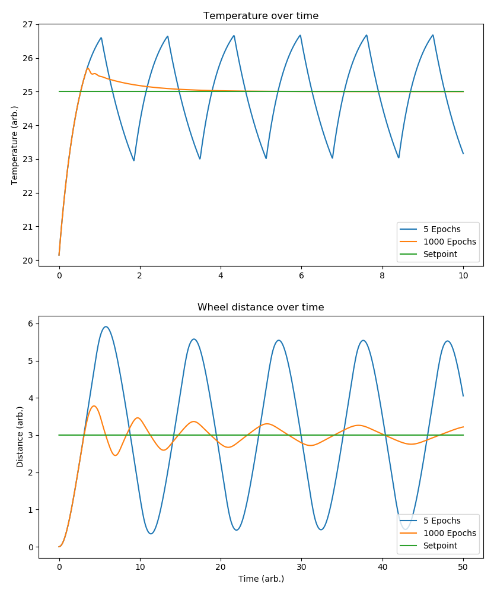

# PID Auto-tuning

This library offers a way to tune your PID feedback loops automatically using gradient descent and advanced optimization techniques. There are 2 example simulations given (a thermostat which must make the room attain a certain temperature), and a robot wheel (which must travel a certain distance exactly, i.e. not go over or under that distance).

Below are the plots of these simulations once they have been tuned.


## How It Works

### PID Control Theory

A PID (Proportional-Integral-Derivative) controller is a feedback control system that continuously calculates an error value as the difference between a desired setpoint and a measured process variable, and applies a correction based on proportional, integral, and derivative terms.

The PID controller output is calculated as:

```
u(t) = Kp * e(t) + Ki * ∫e(t)dt + Kd * (de/dt)
```

Where:
- **Kp (Proportional)**: Responds proportionally to the current error
- **Ki (Integral)**: Accumulates past errors to eliminate steady-state error
- **Kd (Derivative)**: Predicts future errors based on the rate of change

### Automatic Tuning with Gradient Descent (and More)

This library automatically finds optimal PID parameters (Kp, Ki, Kd) using a robust, simulation-based optimization process. Key features:

- **Central Difference Gradient**: Uses central difference for more accurate gradient estimation.
- **Multiple Simulation Runs**: Averages cost over several runs for noise robustness.
- **Custom Cost Functions**: Supports MSE, IAE, ITAE, or your own cost function.
- **Multi-Start Optimization**: Runs from multiple initial PID values to avoid local minima.
- **Adaptive Learning Rate**: Optionally reduces learning rate if progress stalls.

#### Optimization Process

1. **Initialization**: Start with one or more sets of initial PID values (randomized for multi-start).
2. **Simulation Run**: Simulate the system with current PID values over a specified time period.
3. **Error Calculation**: Compute the cost (MSE, IAE, ITAE, or custom) over the simulation, optionally averaging over multiple runs.
4. **Gradient Estimation**: Use central difference to estimate the gradient of the cost with respect to each PID parameter.
5. **Parameter Update**: Apply gradient descent update rule, optionally with adaptive learning rate.
6. **Convergence Check**: Repeat until parameters stabilize or a stopping criterion is met.
7. **Multi-Start**: Optionally repeat the above from several initializations and select the best result.

### Key Components

#### PIDController (`PIDController.py`)
- Implements the standard PID control algorithm
- Maintains integral and derivative terms
- Provides a step-by-step interface for simulation
- Supports output clamping and anti-windup

#### PIDTuner (`PIDTuner.py`)
- Core optimization engine using central-difference gradient descent
- Supports multiple simulation runs for noise robustness
- Allows custom cost functions (MSE, IAE, ITAE, or user-defined)
- Multi-start optimization to avoid local minima
- Adaptive learning rate option
- Provides visualization capabilities

#### Simulator Interface (`Simulations/Simulator.py`)
- Abstract base class for all simulated systems
- Defines standard interface: `set_input()`, `get_output()`, `step()`
- Allows easy addition of new system types

#### Example Simulations

**Thermostat (`Simulations/Thermostat.py`)**
- Simulates room temperature control
- Models heat transfer from heater and ambient environment
- Includes realistic noise/entropy for robustness testing

**Robot Wheel (`Simulations/RobotWheel.py`)**
- Simulates a robot wheel responding to voltage input
- Models physics including friction and responsiveness
- Demonstrates position control challenges

## Usage

### Basic Example (Single Run, MSE Cost)

```python
from Simulations.Thermostat import Thermostat
from PIDTuner import PIDTuner

thermostat_sim = Thermostat(entropy=0.0)
tuner = PIDTuner(thermostat_sim, setpoint=25, t0=0, t1=10, dt=0.01)

# Run optimization
for epoch in range(1000):
    tuner.epoch()

# Get optimized PID values
kp, ki, kd = tuner.get_vals()
print(f"Optimized PID: Kp={kp:.3f}, Ki={ki:.3f}, Kd={kd:.3f}")
```

### Advanced Example: Multi-Start, Noise Robustness, Custom Cost

```python
from Simulations.Thermostat import Thermostat
from PIDTuner import PIDTuner, iae_cost

thermostat_sim = Thermostat(entropy=0.1)
tuner = PIDTuner(thermostat_sim, setpoint=25, t0=0, t1=10, dt=0.01, cost_func=iae_cost)

# Multi-start optimization with 5 random initializations, averaging over 3 noisy runs per evaluation
best_kp, best_ki, best_kd = tuner.multi_start_optimize(
    n_starts=5,
    num_runs=3,           # Average over 3 runs for each evaluation
    max_epochs=1000,
    tol=1e-6,
    gamma=0.01,
    adaptive_lr=True,
    verbose=True
)
print(f"Best PID: Kp={best_kp:.3f}, Ki={best_ki:.3f}, Kd={best_kd:.3f}")
```

### Running the Examples

```bash
python main.py
```

This will:
1. Tune both thermostat and robot wheel simulations
2. Display progress and final PID values
3. Show comparison plots of system response

### Custom Simulations

To add your own system, inherit from `Simulator`:

```python
from Simulations.Simulator import Simulator

class MySystem(Simulator):
    def __init__(self):
        super().__init__(min_input=-1.0, max_input=1.0)
        # Initialize your system state
    def set_input(self, val):
        # Apply input to your system
        pass
    def get_output(self):
        # Return current system output
        return self.output
    def step(self, dt):
        # Update system state for one time step
        pass
```

## Algorithm Details

### Gradient Computation

The gradient is computed using central differences:

```
∂Cost/∂Kp ≈ (Cost(Kp+Δ) - Cost(Kp-Δ)) / (2Δ)
∂Cost/∂Ki ≈ (Cost(Ki+Δ) - Cost(Ki-Δ)) / (2Δ)
∂Cost/∂Kd ≈ (Cost(Kd+Δ) - Cost(Kd-Δ)) / (2Δ)
```

### Cost Functions

- **MSE (Mean Squared Error):** Default, penalizes large errors
- **IAE (Integral of Absolute Error):** Penalizes total error
- **ITAE (Integral of Time-weighted Absolute Error):** Penalizes late errors more
- **Custom:** Pass your own function `cost_func(errors, times)`

### Optimization Process

1. **Initialization**: Start with one or more sets of initial PID values
2. **Simulation Run**: Simulate the system with current PID values
3. **Error Calculation**: Compute cost over the entire simulation period, optionally averaging over multiple runs
4. **Gradient Estimation**: Perturb each parameter and recompute cost using central difference
5. **Parameter Update**: Apply gradient descent update rule
6. **Convergence Check**: Repeat until parameters stabilize
7. **Multi-Start**: Optionally repeat from several initializations and select the best result

### Hyperparameters

- **Learning Rate (γ):** Controls step size in gradient descent (default: 0.01)
- **Delta (Δ):** Small perturbation for gradient estimation (default: 0.01)
- **Number of Epochs:** Total optimization iterations (default: 1000)
- **Time Parameters:** Simulation duration and time step (t0, t1, dt)
- **num_runs:** Number of simulation runs to average for each evaluation (default: 1)
- **cost_func:** Cost function to use (MSE, IAE, ITAE, or custom)

## Advantages

- **Automatic**: No manual tuning required
- **System-Agnostic**: Works with any system implementing the Simulator interface
- **Robust**: Handles noise and non-linearities through simulation and multi-run averaging
- **Flexible**: Customizable cost functions and multi-start optimization
- **Visual**: Provides real-time plotting of optimization progress
- **Educational**: Clear implementation for learning PID control concepts

## Limitations

- **Computational Cost**: Requires multiple simulation runs per optimization step, especially with multi-run and multi-start
- **Local Optima**: Multi-start helps, but not guaranteed to find global optimum
- **Simulation Accuracy**: Performance depends on simulation fidelity
- **Parameter Constraints**: Enforced via clamping

## Requirements

- Python 3.6+
- NumPy
- Matplotlib

## License

This project is open source and available under the MIT License.
